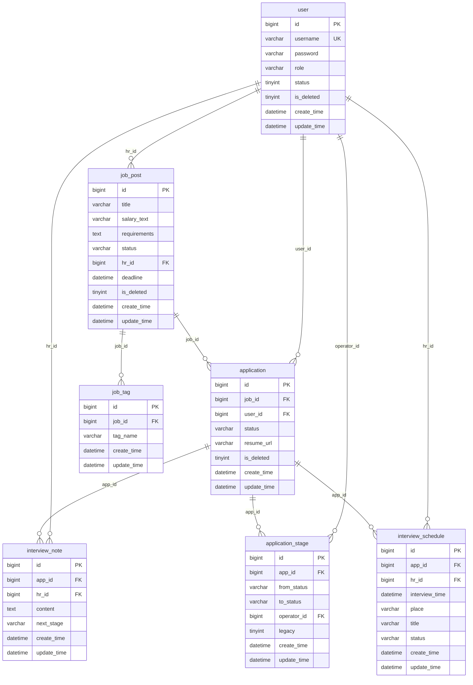

# 招聘管理与人才看板系统 - 数据库设计

> **文档版本**: v1.0 · 2026-05-20  
> **数据库名**: recruitment_db(从 application.yml 提取)  
> **字符集**: utf8mb4 + utf8mb4_unicode_ci  
> **引擎**: InnoDB  
> **全量表数**: 6(P0=4 + P1=2) + P2=1(可选)

---

## 1. ER 图



---

## 2. 表清单与关系说明

| # | 表名 | 用途 | 实现优先级 | 主要关系 |
|---:|---|---|:---:|---|
| 1 | user | 用户基本信息(候选人和HR共用) | P0 | 1:N → job_post(HR发布) / 1:N → application(候选人投递) |
| 2 | job_post | 职位信息(含HR外键) | P0 | N:1 → user(hr_id) / 1:N → application / 1:N → job_tag |
| 3 | application | 投递记录(候选人×职位关联) | P0 | N:1 → user(candidate) / N:1 → job_post / 1:N → interview_note |
| 4 | interview_note | 面试备注(HR写,关联投递) | P0 | N:1 → application / N:1 → user(hr) · content TEXT · next_stage可空(NULL=HR未指定下一阶段) |
| 5 | job_tag | 职位标签(急聘/校招/社招) | P1 | N:1 → job_post · 删除职位时级联删除 |
| 6 | application_stage | 状态变更历史(每次状态流转记录) | P1 | N:1 → application / N:1 → user(operator) · from_status可空(NULL=首次创建) |
| 7 | interview_schedule | 面试日程(日历排面试) | P2 | N:1 → application / N:1 → user(hr) · interview_time索引用于日历查询 |

---

## 3. CREATE TABLE 完整 SQL

### 3.1 user 表

```sql
CREATE TABLE user (
  id          BIGINT        AUTO_INCREMENT PRIMARY KEY COMMENT '主键ID',
  username    VARCHAR(32)   NOT NULL COMMENT '用户名(登录用)',
  password    VARCHAR(255)  NOT NULL COMMENT 'BCrypt加密密码',
  role        VARCHAR(20)   NOT NULL DEFAULT 'candidate' COMMENT '角色:candidate=候选人,hr=招聘方,admin=管理员',
  status      TINYINT(1)    NOT NULL DEFAULT 1 COMMENT '账号状态:1=正常,0=已禁用(教学简化:不做用户删除,仅禁用)',
  is_deleted  TINYINT(1)    NOT NULL DEFAULT 0 COMMENT '逻辑删除:0=正常,1=已删除',
  create_time DATETIME      NOT NULL DEFAULT CURRENT_TIMESTAMP COMMENT '创建时间',
  update_time DATETIME      NOT NULL DEFAULT CURRENT_TIMESTAMP ON UPDATE CURRENT_TIMESTAMP COMMENT '更新时间',
  UNIQUE INDEX uniq_username (username)
) ENGINE=InnoDB DEFAULT CHARSET=utf8mb4 COLLATE=utf8mb4_unicode_ci COMMENT='用户表';
```

### 3.2 job_post 表

```sql
CREATE TABLE job_post (
  id          BIGINT        AUTO_INCREMENT PRIMARY KEY COMMENT '主键ID',
  title       VARCHAR(100)  NOT NULL COMMENT '职位标题',
  salary_text VARCHAR(50)   NOT NULL DEFAULT '' COMMENT '薪资描述(文本·灵活支持面议等表述)',
  requirements TEXT         NULL COMMENT '岗位要求(TEXT类型·上限2000字符·教学简化:无富文本)',
  status      VARCHAR(20)   NOT NULL DEFAULT '招聘中' COMMENT '职位状态:招聘中/停招·条件UPDATE防并发覆盖(status=招聘中时才能改为停招)',
  hr_id       BIGINT        NOT NULL COMMENT '发布者HR的用户ID(FK→user.id)',
  deadline    DATETIME      NULL COMMENT '截止日期(NULL=长期有效·不参与过期自动下架逻辑)',
  is_deleted  TINYINT(1)    NOT NULL DEFAULT 0 COMMENT '逻辑删除:0=正常,1=已删除',
  create_time DATETIME      NOT NULL DEFAULT CURRENT_TIMESTAMP COMMENT '创建时间',
  update_time DATETIME      NOT NULL DEFAULT CURRENT_TIMESTAMP ON UPDATE CURRENT_TIMESTAMP COMMENT '更新时间',
  INDEX idx_hr_id (hr_id),
  INDEX idx_status (status),
  FOREIGN KEY (hr_id) REFERENCES user(id) ON DELETE RESTRICT   -- HR账号有职位时拒绝删除(对齐PRD P0-1业务规则:不做用户删除,仅禁用)
) ENGINE=InnoDB DEFAULT CHARSET=utf8mb4 COLLATE=utf8mb4_unicode_ci COMMENT='职位表';
```

### 3.3 application 表

```sql
CREATE TABLE application (
  id          BIGINT        AUTO_INCREMENT PRIMARY KEY COMMENT '主键ID',
  job_id      BIGINT        NOT NULL COMMENT '职位ID(FK→job_post.id)',
  user_id     BIGINT        NOT NULL COMMENT '候选人用户ID(FK→user.id)',
  status      VARCHAR(20)   NOT NULL DEFAULT '待筛选' COMMENT '申请状态:待筛选/已面试/已录用/已拒绝·条件UPDATE防并发(status=旧值→新值)',
  resume_url  VARCHAR(255)  NOT NULL COMMENT '简历文件路径(uploads/resume/{userId}/{timestamp}_{filename})',
  is_deleted  TINYINT(1)    NOT NULL DEFAULT 0 COMMENT '逻辑删除:0=正常,1=已删除',
  create_time DATETIME      NOT NULL DEFAULT CURRENT_TIMESTAMP COMMENT '创建时间(投递时间)',
  update_time DATETIME      NOT NULL DEFAULT CURRENT_TIMESTAMP ON UPDATE CURRENT_TIMESTAMP COMMENT '更新时间',
  UNIQUE INDEX uniq_job_user (job_id, user_id) COMMENT '防重复投递(DB层唯一约束)',
  INDEX idx_job_id (job_id),
  INDEX idx_user_id (user_id),
  INDEX idx_status (status),
  FOREIGN KEY (job_id) REFERENCES job_post(id) ON DELETE RESTRICT  -- 职位有投递记录时拒绝删除(对齐PRD P0-7:软删除职位)
) ENGINE=InnoDB DEFAULT CHARSET=utf8mb4 COLLATE=utf8mb4_unicode_ci COMMENT='投递记录表';
```

### 3.4 interview_note 表

```sql
CREATE TABLE interview_note (
  id          BIGINT        AUTO_INCREMENT PRIMARY KEY COMMENT '主键ID',
  app_id      BIGINT        NOT NULL COMMENT '投递记录ID(FK→application.id)',
  hr_id       BIGINT        NOT NULL COMMENT 'HR用户ID(FK→user.id)',
  content     TEXT          NOT NULL COMMENT '面试备注内容',
  next_stage  VARCHAR(20)   NULL COMMENT '下一阶段建议(NULL=HR未指定·枚举:初筛/技术面/HR面/终面/offer)',
  create_time DATETIME      NOT NULL DEFAULT CURRENT_TIMESTAMP COMMENT '创建时间',
  update_time DATETIME      NOT NULL DEFAULT CURRENT_TIMESTAMP ON UPDATE CURRENT_TIMESTAMP COMMENT '更新时间',
  INDEX idx_app_id (app_id),
  FOREIGN KEY (app_id) REFERENCES application(id) ON DELETE RESTRICT,  -- 有面试记录时拒绝删除投递
  FOREIGN KEY (hr_id) REFERENCES user(id) ON DELETE RESTRICT            -- 有面试记录时拒绝删除HR
) ENGINE=InnoDB DEFAULT CHARSET=utf8mb4 COLLATE=utf8mb4_unicode_ci COMMENT='面试备注表';
```

### 3.5 job_tag 表(P1)

```sql
CREATE TABLE job_tag (
  id          BIGINT        AUTO_INCREMENT PRIMARY KEY COMMENT '主键ID',
  job_id      BIGINT        NOT NULL COMMENT '职位ID(FK→job_post.id)',
  tag_name    VARCHAR(20)   NOT NULL COMMENT '标签名(如:急聘/校招/社招)',
  create_time DATETIME      NOT NULL DEFAULT CURRENT_TIMESTAMP COMMENT '创建时间',
  update_time DATETIME      NOT NULL DEFAULT CURRENT_TIMESTAMP ON UPDATE CURRENT_TIMESTAMP COMMENT '更新时间',
  UNIQUE INDEX uniq_job_tag (job_id, tag_name) COMMENT '同一职位下标签名唯一',
  FOREIGN KEY (job_id) REFERENCES job_post(id) ON DELETE CASCADE  -- 删除职位时级联删除标签(标签完全从属于职位)
) ENGINE=InnoDB DEFAULT CHARSET=utf8mb4 COLLATE=utf8mb4_unicode_ci COMMENT='职位标签表(P1)';
```

### 3.6 application_stage 表(P1)

```sql
CREATE TABLE application_stage (
  id          BIGINT        AUTO_INCREMENT PRIMARY KEY COMMENT '主键ID',
  app_id      BIGINT        NOT NULL COMMENT '投递记录ID(FK→application.id)',
  from_status VARCHAR(20)   NULL COMMENT '变更前状态(NULL=首次创建·P0→P1迁移时已存在的逆序记录标记legacy=1)',
  to_status   VARCHAR(20)   NOT NULL COMMENT '变更后状态(待筛选/已面试/已录用/已拒绝)',
  operator_id BIGINT        NOT NULL COMMENT '操作人用户ID(FK→user.id)',
  legacy      TINYINT(1)    NOT NULL DEFAULT 0 COMMENT '遗留标记:0=P1后新记录(受正向流转约束),1=P0遗留逆序记录(跳过校验)',
  create_time DATETIME      NOT NULL DEFAULT CURRENT_TIMESTAMP COMMENT '创建时间(状态变更时间)',
  update_time DATETIME      NOT NULL DEFAULT CURRENT_TIMESTAMP ON UPDATE CURRENT_TIMESTAMP COMMENT '更新时间',
  INDEX idx_app_id (app_id),
  INDEX idx_operator_id (operator_id),
  FOREIGN KEY (app_id) REFERENCES application(id) ON DELETE RESTRICT,
  FOREIGN KEY (operator_id) REFERENCES user(id) ON DELETE RESTRICT
) ENGINE=InnoDB DEFAULT CHARSET=utf8mb4 COLLATE=utf8mb4_unicode_ci COMMENT='状态变更历史表(P1)';
```

### 3.7 interview_schedule 表(P2 · 可选)

```sql
CREATE TABLE interview_schedule (
  id             BIGINT      AUTO_INCREMENT PRIMARY KEY COMMENT '主键ID',
  app_id         BIGINT      NOT NULL COMMENT '投递记录ID(FK→application.id)',
  hr_id          BIGINT      NOT NULL COMMENT '安排面试的HR用户ID(FK→user.id)',
  interview_time DATETIME    NOT NULL COMMENT '面试时间',
  place          VARCHAR(100) NULL COMMENT '面试地点',
  title          VARCHAR(100) NULL COMMENT '面试标题',
  status         VARCHAR(20) NOT NULL DEFAULT '已安排' COMMENT '面试状态:已安排/已完成/已取消',
  create_time    DATETIME    NOT NULL DEFAULT CURRENT_TIMESTAMP COMMENT '创建时间',
  update_time    DATETIME    NOT NULL DEFAULT CURRENT_TIMESTAMP ON UPDATE CURRENT_TIMESTAMP COMMENT '更新时间',
  INDEX idx_app_id (app_id),
  INDEX idx_hr_time (hr_id, interview_time) COMMENT '日历查询索引(按HR+时间范围查)',
  FOREIGN KEY (app_id) REFERENCES application(id) ON DELETE RESTRICT,
  FOREIGN KEY (hr_id) REFERENCES user(id) ON DELETE RESTRICT
) ENGINE=InnoDB DEFAULT CHARSET=utf8mb4 COLLATE=utf8mb4_unicode_ci COMMENT='面试日程表(P2·可选)';
```

---

## 4. 测试数据

> INSERT 按外键依赖顺序: user → job_post → application → interview_note

```sql
-- 1. user(密码均为 123456 的 BCrypt 哈希)
INSERT INTO user (username, password, role) VALUES
('candidate01', '$2a$10$N.zmdr9k7uOCQb376NoUnuTJ8iAt6Z5EHsM8lE9lBOsl7iAt6Z5Eh', 'candidate'),
('candidate02', '$2a$10$N.zmdr9k7uOCQb376NoUnuTJ8iAt6Z5EHsM8lE9lBOsl7iAt6Z5Eh', 'candidate'),
('hr01',        '$2a$10$N.zmdr9k7uOCQb376NoUnuTJ8iAt6Z5EHsM8lE9lBOsl7iAt6Z5Eh', 'hr'),
('hr02',        '$2a$10$N.zmdr9k7uOCQb376NoUnuTJ8iAt6Z5EHsM8lE9lBOsl7iAt6Z5Eh', 'hr'),
('admin01',     '$2a$10$N.zmdr9k7uOCQb376NoUnuTJ8iAt6Z5EHsM8lE9lBOsl7iAt6Z5Eh', 'admin');

-- 2. job_post
INSERT INTO job_post (title, salary_text, requirements, status, hr_id, deadline) VALUES
('Java后端开发工程师', '15K-25K', '3年以上Java开发经验,熟悉SpringBoot、MySQL', '招聘中', 3, '2026-07-01 00:00:00'),
('前端开发工程师(Vue)', '12K-20K', '熟悉Vue3+Element Plus,2年以上经验', '招聘中', 3, NULL),
('产品经理', '18K-30K', '3年B端产品经验,有招聘系统经验优先', '招聘中', 4, '2026-06-15 00:00:00'),
('UI设计师', '10K-18K', '熟悉Figma/Sketch,有设计系统经验', '停招', 4, NULL),
('数据分析师', '13K-22K', 'SQL熟练,会Python/R,有报表开发经验', '招聘中', 3, '2026-08-01 00:00:00');

-- 3. application
INSERT INTO application (job_id, user_id, status, resume_url) VALUES
(1, 1, '待筛选', 'uploads/resume/1/resume_candidate01_java.pdf'),
(1, 2, '已面试', 'uploads/resume/2/resume_candidate02_java.pdf'),
(2, 1, '已录用', 'uploads/resume/1/resume_candidate01_vue.pdf'),
(3, 2, '待筛选', 'uploads/resume/2/resume_candidate02_pm.pdf'),
(5, 1, '已拒绝', 'uploads/resume/1/resume_candidate01_data.pdf');

-- 4. interview_note
INSERT INTO interview_note (app_id, hr_id, content, next_stage) VALUES
(2, 3, 'Java基础扎实,项目经验丰富,推荐进入下一轮', '技术面'),
(2, 3, '技术面通过,沟通能力好,建议HR面', 'HR面'),
(3, 3, 'Vue3项目经验匹配,直接录用', 'offer'),
(5, 3, '数据分析经验不足,不符合要求', NULL);
```
