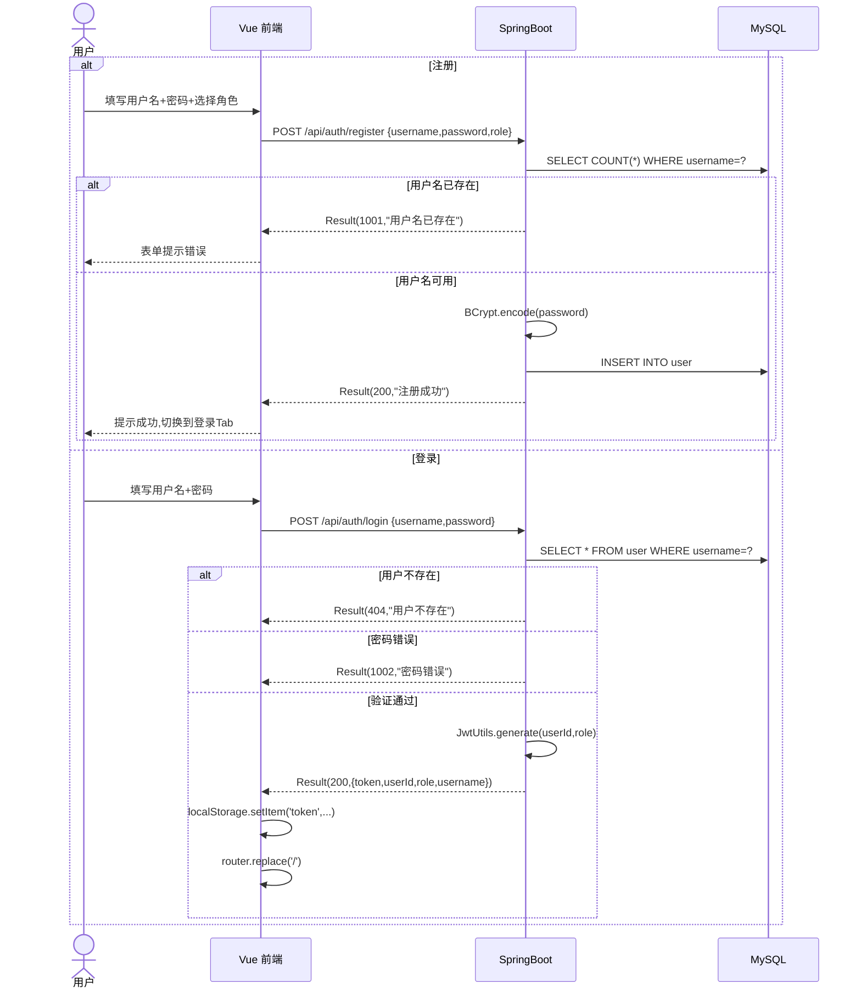
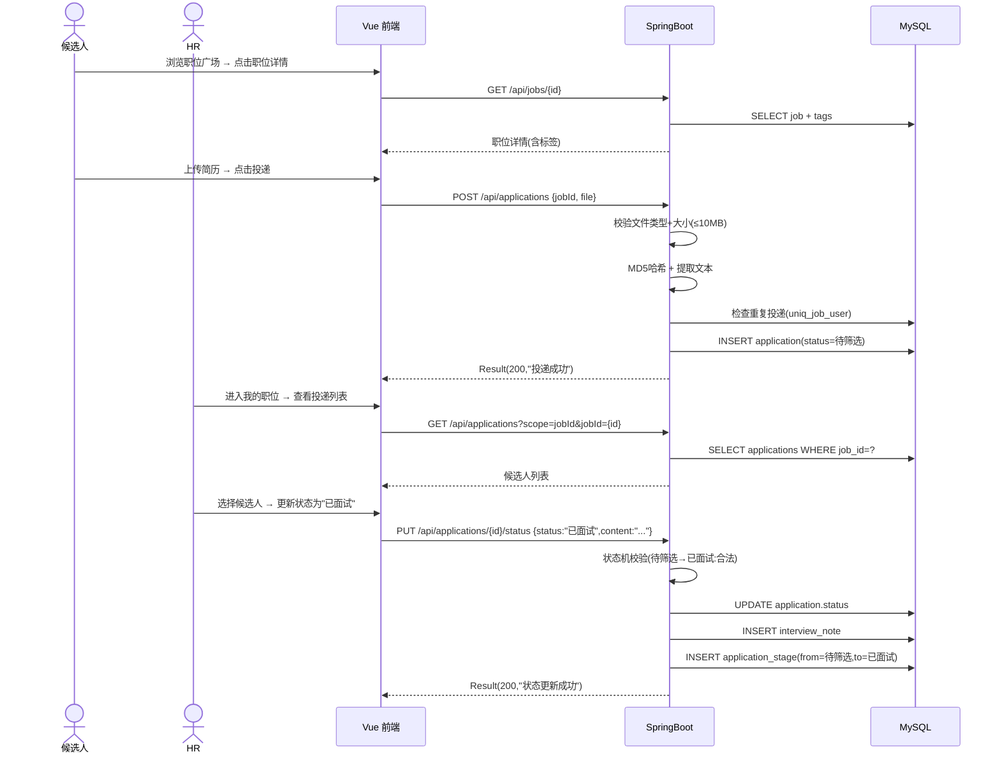
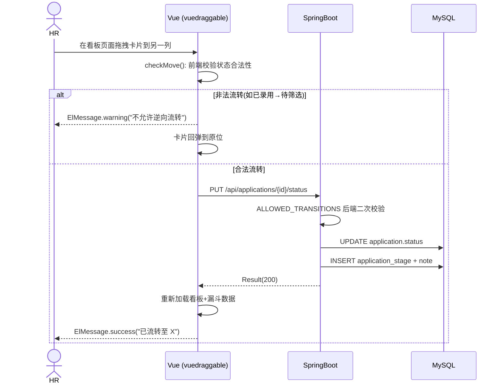

# 招聘管理与人才看板系统 - 概要设计

> **文档版本**: v1.0 · 2026-05-21
> **基于**: `docs/PRD.md`(v1.0) + `docs/DATABASE_DESIGN.md`(v1.0)
> **技术栈基线**: 2026-05-10(见 `CLAUDE.md §一·一`)

---

## 1. 系统架构

```
┌──────────────────────────────────────────────────────────┐
│                    前端 SPA (Vue 3)                       │
│  Vite 8.0.0 + Vue Router 5 + Pinia 3 + Element Plus 2   │
│  端口: vite.config.js proxy → :8080 (后端)                │
└──────────────────┬───────────────────────────────────────┘
                   │  HTTP REST (JSON) · JWT Bearer Token
                   │  baseURL: /api
┌──────────────────▼───────────────────────────────────────┐
│               后端 SpringBoot 3.5.14                       │
│  ┌──────────────────────────────────────────────────┐    │
│  │  Controller 层 (5 个 Controller)                   │    │
│  │  Auth / Job / Application / Statistics / Schedule │    │
│  ├──────────────────────────────────────────────────┤    │
│  │  Interceptor: LoginInterceptor (JWT 校验)          │    │
│  │  放行: /api/auth/login, /api/auth/register         │    │
│  ├──────────────────────────────────────────────────┤    │
│  │  Service 层 (3 个 Service + Impl)                  │    │
│  │  UserService / JobService / ApplicationService     │    │
│  ├──────────────────────────────────────────────────┤    │
│  │  Mapper 层 (7 个 Mapper · MyBatis-Plus 3.5.15)     │    │
│  │  User / Job / Application / InterviewNote          │    │
│  │  JobTag / ApplicationStage / InterviewSchedule     │    │
│  └──────────────────────────────────────────────────┘    │
│                                                           │
│  配置层: CorsConfig / MybatisPlusConfig / WebMvcConfig    │
│  通用层: Result<T> / BusinessException / GlobalException  │
│  工具层: JwtUtils / ResumeParseUtil                       │
└──────────────────┬───────────────────────────────────────┘
                   │  JDBC (MyBatis-Plus)
┌──────────────────▼───────────────────────────────────────┐
│              MySQL 8.4 LTS (recruitment_db)               │
│  P0 表: user / job_post / application / interview_note   │
│  P1 表: job_tag / application_stage                       │
│  P2 表: interview_schedule                                │
│  Redis (可选 · 缓存 job 列表 TTL 5min)                     │
└──────────────────────────────────────────────────────────┘
```

### 架构决策

| 决策点 | 选择 | 理由 |
|---|---|---|
| 前后端分离 | SPA + RESTful API | 职责清晰，与 Vue 3 生态一致 |
| 认证方案 | JWT (JJWT 0.13.0) | 无状态，适合 SPA；2h 过期，单 token 模式(教学简化) |
| 密码加密 | BCrypt (spring-security-crypto) | 行业标准，单向哈希 |
| ORM | MyBatis-Plus 3.5.15 | LambdaQueryWrapper 防 SQL 注入，BaseMapper 减少模板代码 |
| 参数校验 | `@Valid` + `@NotBlank`/`@Size`/`@Pattern` | Spring 标准校验，前后端双重校验 |
| 缓存 | Redis (TTL 5min) | 降低职位列表高频查询压力(可选，无 Redis 时自动回退) |
| 文件存储 | 本地 `uploads/resume/{userId}/` | 教学简化，P2 可升级 OSS |

---

## 2. 后端模块划分

### 2.1 分层职责

| 层 | 包路径 | 文件数 | 职责 |
|---|---|---|---|
| Controller | `controller/` | 5 | 接收 HTTP 请求、参数校验、调用 Service、返回 Result\<T\> |
| Service | `service/` + `service/impl/` | 3+3 | 全部业务逻辑、状态机校验、事务管理 |
| Mapper | `mapper/` | 7 | ORM 映射，继承 BaseMapper\<Entity\> |
| Entity | `entity/` | 7+7 | 数据库表映射 + DTO 传输对象 |
| Config | `config/` | 4 | CORS / MyBatisPlus / Redis / WebMvc 配置 |
| Interceptor | `interceptor/` | 1 | LoginInterceptor: JWT 校验 + userId/role 注入 request |
| Common | `common/` | 3 | Result\<T\> / BusinessException / GlobalExceptionHandler |
| Util | `util/` | 2 | JwtUtils / ResumeParseUtil |

### 2.2 业务模块

| 模块 | Controller | Service | 核心功能 |
|---|---|---|---|
| 认证模块 | AuthController | UserService | 注册(BCrypt) + 登录(JWT签发) + 获取当前用户 |
| 职位模块 | JobController | JobService | 列表(分页+多条件搜索+标签) + 详情 + 增/改/删(软删除) |
| 投递模块 | ApplicationController | ApplicationService | 投递(文件上传) + 列表查询(scope: mine/myJobs/jobId) + 状态更新(状态机+备注+阶段历史) + Offer生成 + 简历查重 |
| 统计模块 | StatisticsController | (直接查Mapper) | 招聘漏斗(按状态分组统计) |
| 面试日程 | InterviewScheduleController | (直接查Mapper) | 面试日程 CRUD + 模拟邮件通知 |

### 2.3 状态机

```
         待筛选 ──────→ 已面试 ──────→ 已录用
            │              │
            └──────→ 已拒绝 ←──────┘
```

实现位置: `ApplicationServiceImpl.updateStatus()`，`ALLOWED_TRANSITIONS` Map:
- `待筛选` → {已面试, 已拒绝}
- `已面试` → {已录用, 已拒绝}
- `已录用` / `已拒绝` → 无出口(终态)

状态变更时自动写入 `application_stage` 记录(含 from_status / to_status / operator_id / legacy=0)。

---

## 3. 前端路由设计

### 3.1 路由表

| 路径 | 组件 | 路由名称 | 是否需要登录 | 角色权限 |
|---|---|---|---|---|
| `/login` | LoginPage | Login | 否 | 无 |
| `/` | JobSquarePage | Home | 是 | candidate / hr / admin |
| `/job/:id` | JobDetailPage | JobDetail | 是 | candidate / hr / admin |
| `/my-applications` | MyApplicationsPage | MyApplications | 是 | candidate |
| `/my-jobs` | MyJobsPage | MyJobs | 是 | hr / admin |
| `/kanban` | KanbanPage | Kanban | 是 | hr / admin |

### 3.2 路由守卫

`router.beforeEach`:
1. 目标路由 `meta.requiresAuth === true`
2. `localStorage.getItem('token')` 不存在
3. → 跳转 `/login`，携带 `?redirect=` 原目标路径

登录成功后写入 `localStorage`: `token` + `role` + `user`(JSON)，然后 `router.replace(redirect)`。

### 3.3 页面导航关系

```
LoginPage ──登录成功──→ JobSquarePage (首页)
                            │
              ┌─────────────┼─────────────┐
              ▼             ▼             ▼
       JobDetailPage  MyApplicationsPage  MyJobsPage
       (投递简历)      (我的申请列表)     (发布/编辑/下架职位)
                                              │
                                         ┌────▼────┐
                                         ▼         ▼
                                   KanbanPage  JobDetailPage
                                   (看板+漏斗)  (查看候选人)
```

---

## 4. 关键业务流程图

### 4.1 登录注册流程



### 4.2 投递与状态流转流程



### 4.3 看板拖拽流程



---

## 5. 技术方案选型

### 5.1 后端选型

| 技术点 | 选型 | 版本 | 说明 |
|---|---|---|---|
| JDK | Java 21 | 21 LTS | 最新 LTS，虚拟线程可用(本项目未用) |
| 框架 | SpringBoot | 3.5.14 | LTS 支持至 2027-05 |
| ORM | MyBatis-Plus | 3.5.15 | LambdaQueryWrapper 防注入 |
| 数据库 | MySQL | 8.4 LTS | 驱动 mysql-connector-j 8.4.0 |
| JWT | JJWT | 0.13.0 | 模块化引入(api+impl+jackson) |
| 密码 | spring-security-crypto | 6.3.4 | 仅引入 BCrypt 子模块 |
| 缓存 | Redis (spring-boot-starter-data-redis) | 自动配置 | TTL 5min，无 Redis 时自动回退 |
| 构建 | Maven | 3.9 | pom.xml 管理依赖 |

### 5.2 前端选型

| 技术点 | 选型 | 版本 | 说明 |
|---|---|---|---|
| 框架 | Vue 3 | 3.5.34 | Composition API + `<script setup>` |
| 路由 | Vue Router | 5.0.6 | createWebHistory 模式 |
| 状态管理 | Pinia | 3.0.4 | 组合式 Store 写法(本项目暂无复杂跨组件状态，stores/ 为预留) |
| UI 库 | Element Plus | 2.13.7 | 全局注册，单一 UI 库 |
| HTTP | Axios | 1.15.2 | 统一拦截器(请求加Token+响应解Result) |
| 构建 | Vite | 8.0.0 | Rolldown+Oxc 引擎 |
| 包管理 | pnpm | 10.33.4 | 严格依赖隔离 |
| 图表 | ECharts + vue-echarts | 6.1.0 / 8.0.1 | 招聘漏斗图 |
| 拖拽 | vuedraggable | 4.1.0 | 看板卡片拖拽 |

### 5.3 关键方案决策

**文件上传**:
- 存储路径: `uploads/resume/{userId}/{timestamp}_{filename}`
- 文件名校验: 仅保留 `[a-zA-Z0-9._-]`，过滤特殊字符防路径穿越
- 类型白名单: .pdf / .doc / .docx / .txt
- 大小限制: 10MB
- 简历解析: 教学简化，仅提取文本前 5000 字符 + MD5 哈希去重

**分页规范**:
- 参数: `pageNum`(默认1) + `pageSize`(默认10)
- 返回: MyBatis-Plus `Page<T>` → 前端读取 `res.data.records` + `res.data.total`
- 后端兼容 pageNum ≤ 0 → 取第 1 页

**缓存策略**:
- `@Cacheable("jobs")`: 职位列表，key = `pageNum:pageSize:keyword:status:salaryKeyword:reqKeyword:tag`
- `@Cacheable("jobDetail")`: 职位详情，key = `id`
- `@CacheEvict`: 创建/更新/删除职位时清除全部 jobs 缓存

---

## 6. 页面原型描述

### 6.1 LoginPage (登录/注册页)

```
┌──────────────────────────────────┐
│                                  │
│    招聘管理与人才看板系统          │
│          登录 / 注册              │
│                                  │
│  ┌────────────────────────────┐  │
│  │ 👤 用户名                   │  │
│  ├────────────────────────────┤  │
│  │ 🔒 密码                     │  │
│  ├────────────────────────────┤  │
│  │ 📋 选择角色 (仅注册时显示)    │  │
│  │   [候选人] [HR]             │  │
│  ├────────────────────────────┤  │
│  │ [      登录 / 注册        ] │  │
│  └────────────────────────────┘  │
│                                  │
│    没有账号？去注册  /  已有账号？  │
│                                  │
└──────────────────────────────────┘
```

- **组件**: `el-form` + `el-input` + `el-select` + `el-button`
- **模式切换**: `isLogin` ref 控制登录/注册 Tab 切换
- **校验**: 用户名 3-20 字符, 密码 6-32 字符, 角色必选
- **注册成功**: 自动切换到登录 Tab
- **登录成功**: 写入 localStorage → router.replace 跳转首页或 redirect 参数
- **页面样式**: 渐变紫蓝背景 + 居中白色卡片(400px 宽)

### 6.2 JobSquarePage (职位广场/首页)

```
┌──────────────────────────────────────────────────────┐
│ 职位广场          [用户名/角色] [人才看板] [我的职位] [我的投递] [退出] │
├──────────────────────────────────────────────────────┤
│ [搜索职位/要求...] [状态▼] [薪资关键词] [标签筛选] [搜索] │
├──────────────────────────────────────────────────────┤
│ ID │ 职位名称        │ 薪资    │ 标签       │ 截止日期  │ 操作  │
│ 1  │ Java后端开发     │ 15K-25K │ 急聘 校招  │ 2026-07-01│ 查看  │
│ 2  │ 前端开发(Vue)    │ 12K-20K │ 社招       │ 长期有效  │ 查看  │
│ ...                                                 │
├──────────────────────────────────────────────────────┤
│                              共 N 条  [分页组件]      │
└──────────────────────────────────────────────────────┘
```

- **组件**: `el-table` + `el-pagination` + `el-tag`(标签列)
- **搜索栏**: keyword(标题/要求模糊) + status(招聘中/停招) + salaryKeyword + tagFilter
- **标签列**: 点击标签自动填入筛选框并触发搜索
- **导航按钮**: 根据角色显示——HR/admin 可见"人才看板"+"我的职位"，所有角色可见"我的投递"
- **退出**: `ElMessageBox.confirm` → 清 localStorage → 跳转 `/login`
- 职位详情通过 `router.push(/job/${id})` 跳转

### 6.3 JobDetailPage (职位详情页)

```
┌──────────────────────────────────────────────────────┐
│ ← 返回广场        职位详情                            │
├──────────────────────────────────────────────────────┤
│                                                      │
│  职位标题: Java后端开发工程师                          │
│  薪资: 15K-25K                                       │
│  标签: [Java] [SpringBoot] [MySQL]                   │
│  状态: 招聘中                                        │
│  发布者: hr01                                        │
│  截止日期: 2026-07-01                                │
│  发布时间: 2026-05-20 10:30                          │
│                                                      │
│  职位要求:                                           │
│  ┌────────────────────────────────────────────────┐  │
│  │ 3年以上Java开发经验,熟悉SpringBoot、MySQL       │  │
│  └────────────────────────────────────────────────┘  │
│                                                      │
│  [  投递简历  ]  (仅候选人可见)                       │
│                                                      │
└──────────────────────────────────────────────────────┘
```

- **组件**: `el-descriptions` + `el-tag` + `el-button`
- **数据来源**: `GET /api/jobs/{id}` → 展示全部职位字段 + 标签列表
- **投递按钮**: 仅 `role === 'candidate'` 可见；点击触发文件上传 → `POST /api/applications`
- **权限**: 已投递过该职位的候选人会收到 1003 错误提示

### 6.4 MyApplicationsPage (我的申请)

```
┌──────────────────────────────────────────────────────┐
│ ← 返回广场        我的申请                            │
├──────────────────────────────────────────────────────┤
│ 申请ID │ 职位名称        │ 当前状态    │ 投递时间      │
│ 1      │ Java后端开发     │ 待筛选      │ 2026-05-20    │
│ 3      │ 前端开发(Vue)    │ 已录用      │ 2026-05-19    │
│ ...                                                 │
├──────────────────────────────────────────────────────┤
│                              共 N 条  [分页组件]      │
└──────────────────────────────────────────────────────┘
```

- **组件**: `el-table` + `el-pagination` + `el-tag`(状态标签)
- **数据来源**: `GET /api/applications?scope=mine` → 候选人只看自己的投递
- **状态标签颜色**: 待筛选=warning / 已面试=primary / 已录用=success / 已拒绝=danger
- **查看进度**: 点击行可展开阶段历史时间线(调用 `GET /api/applications/{id}/stages`)

### 6.5 MyJobsPage (我的职位 · HR 端)

```
┌──────────────────────────────────────────────────────┐
│ ← 职位广场        我的职位            [发布新职位]     │
├──────────────────────────────────────────────────────┤
│ ID │ 职位名称    │ 薪资    │ 状态   │ 发布时间 │ 操作      │
│ 1  │ Java后端开发 │ 15K-25K │ 招聘中 │ 05-20   │ 投递 编辑 下架│
│ 2  │ 前端开发    │ 12K-20K │ 招聘中 │ 05-20   │ 投递 编辑 下架│
│ ...                                                 │
└──────────────────────────────────────────────────────┘

┌─ 发布/编辑职位弹窗 ──────────────────────────────────┐
│ 职位名称: [___________________]  (≤100字)            │
│ 薪资:     [___________________]  (≤50字)             │
│ 职位要求: [___________________]  (≤2000字,多行)      │
│           [___________________]                      │
│ 截止日期: [___________________]  可留空(长期有效)     │
│ 标签:     [___________________]  逗号分隔             │
│                              [取消] [发布/保存]       │
└─────────────────────────────────────────────────────┘

┌─ 投递列表弹窗 ──────────────────────────────────────┐
│ 申请ID │ 候选人   │ 状态   │ 简历  │ 投递时间 │ 操作    │
│ 1      │ candidate01 │ 待筛选 │ 已上传│ 05-20  │ 面试 拒绝│
│ 2      │ candidate02 │ 已面试 │ 已上传│ 05-20  │ 录用 拒绝│
│                                    [关闭]           │
└─────────────────────────────────────────────────────┘
```

- **核心功能**:
  - 职位 CRUD: 发布(创建弹窗) / 编辑(预填当前值) / 下架(二次确认后软删除)
  - 投递列表: 点击"投递列表"按钮弹出该职位所有候选人
  - 状态流转: "待筛选"→可点"安排面试"或"拒绝"；"已面试"→可点"录用"或"拒绝"
  - 状态更新弹窗: 备注内容(可选) + 下一环节(可选)
  - Offer 生成: 已录用候选人可点"Offer"按钮 → 展示录用通知书模板

### 6.6 KanbanPage (人才看板 · HR/Admin 端)

```
┌──────────────────────────────────────────────────────┐
│ 人才看板                          [HR筛选▼]           │
├──────────────────────────────────────────────────────┤
│  ECharts 招聘漏斗图                                   │
│  ┌────────────────────────────────────────────────┐  │
│  │         待筛选 (5人)                            │  │
│  │       ┌──────────┐                              │  │
│  │       │  已面试   │  (3人)                      │  │
│  │       │ ┌──────┐ │                              │  │
│  │       │ │已录用 │ │  (2人)                       │  │
│  │       │ │┌────┐│ │                              │  │
│  │       │ ││拒绝││ │  (1人)                        │  │
│  └────────────────────────────────────────────────┘  │
├──────────────────────────────────────────────────────┤
│  待筛选 (2)  │  已面试 (1)  │  已录用 (1)  │  已拒绝 (1)  │
│ ┌──────────┐ │ ┌──────────┐ │ ┌──────────┐ │ ┌──────────┐ │
│ │Java后端   │ │ │前端开发   │ │ │前端开发   │ │ │数据分析   │ │
│ │candidate01│ │ │candidate02│ │ │candidate01│ │ │candidate01│ │
│ │2026-05-20 │ │ │2026-05-19 │ │ │2026-05-19 │ │ │2026-05-18 │ │
│ │[详情]     │ │ │[详情]     │ │ │[详情]     │ │ │[详情]     │ │
│ └──────────┘ │ └──────────┘ │ └──────────┘ │ └──────────┘ │
│ ┌──────────┐ │              │              │              │
│ │产品经理   │ │              │              │              │
│ │candidate02│ │              │              │              │
│ │[详情]     │ │              │              │              │
│ └──────────┘ │              │              │              │
└────────────────────────────────────────────────────────────────┘
```

- **组件**: `v-chart`(vue-echarts 漏斗图) + `draggable`(vuedraggable 四列看板)
- **漏斗图**: ECharts FunnelChart，数据来自 `GET /api/statistics/funnel?hrId=`
- **看板列**: 四列 (待筛选/已面试/已录用/已拒绝)，每列 `el-card` 卡片列表
- **拖拽**: 拖动卡片到目标列 → `checkMove()` 前端校验 → `PUT /api/applications/{id}/status`
- **详情弹窗**: 点击卡片 → `el-dialog` 展示投递详情 + 阶段历史时间线 + 状态流转操作 + Offer生成 + 简历解析 + 面试日程管理
- **角色**: Admin 可见 HR 筛选下拉框选择查看不同 HR 的看板数据

---

> **下一步**: 本文档与 `docs/PRD.md` + `docs/DATABASE_DESIGN.md` + `docs/API_DESIGN.md` 共同构成完整的项目设计文档。
